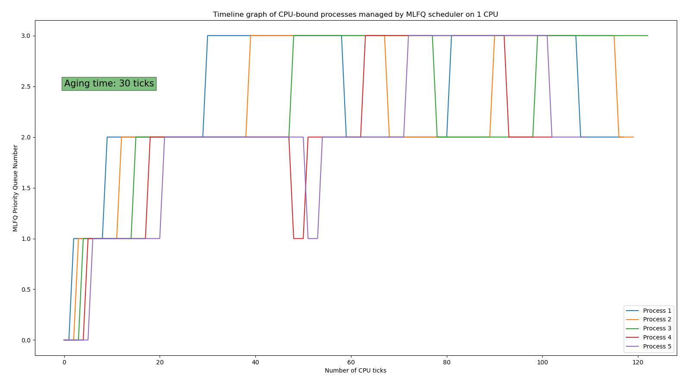

[](https://classroom.github.com/a/DLipn7os)

---

__NOTE:__ Run *make qemu SCHEDULER=...* to choose a scheduler other than the DEFAULT (Round Robin) scheduler! "..." can be either FCFS or MLFQ. Remove the "SCHEDULER" variable altogether to choose the default scheduler.

---
# Specification 3:

# Scheduler Algorithms Implementation:

## First Come, First Serve (Non-Preemptive) (FCFS):
1. Used the ctime variable in the proc struct (in proc.h) which keeps track of the time (in ticks) at which the process arrived.
2. This variable has already been initialised in the allocproc() function under the found label (in proc.c), and is set to the ticks at which the process arrived.
3. Wrote the algorithm for the process under scheduler() function (in proc.c) with a pre-processor directive #ifdef FCFS, which is set by the Makefile, if FCFS is chosen at compile time. The algorithm is essentially as follows:
   1. Made a struct proc* currProcess variable to keep track of the currently chosen process.
   2. Initially, it is set to 0. I trivially set it to the first process in the list that is RUNNABLE, and for every subsequent process, I compare it's starting time with this process. If it starts earlier, then I choose it instead. I keep doing this until I determine the earliest started process. Note that I do not release the lock of the process that I've chosen to be my running process, since I don't want a race condition to arise when this process's struct is accessed on multiple threads.
   3. With the earliest started process, I do the exact same thing that Round Robin (default) scheduler does to run the process; I already have this process's lock (from earlier), change its state to RUNNING, and then hand its control to the CPU. When it is done, I release this process's lock.
4. I ensured that this scheduler is Non-Preemptive, by disabling the timer interrupt (in trap.c), when FCFS macro is defined (for DEFAULT and MLFQ, they work as expected.) I did this, by making sure that yield() in usertrap() and kerneltrap() is called only when scheduler chosen is NOT FCFS, when a timer interrupt is hit (which_dev == 2 for a timer interrupt, as it takes the return value from devintr()).
5. __ASSUMPTION:__ CPU-bound processes run before I/O or interactive processes.

## Multilevel Feedback Queues (Preemptive) (MLFQ):
1. Added 4 variables to the proc struct (in proc.h), wherein, I keep track of the current priority queue that the process is in, the number of ticks that have elapsed since the process was created, the position in the priority queue where the process is at, and the number of ticks it has been waiting for because of the process that is currently running.
2. Also defined macros (in proc.h), to quickly change out the MAX_WAIT_TIME of a process (before its priority gets bumped up, i.e., aging time), and also to quickly add more queues if necessary (just change the LEAST_PQ_PRIORITY macro (in proc.h)). Remember to change the maxTickTimes array, which is defined as a global array (in proc.c, at the top).
3. Wrote the algorithm for process under scheduler() function (in proc.c) with a pre-processor directive #elifdef MLFQ, which is set by Makefile, if MLFQ is chosen at compile time. The algorithm is essentially as follows:
   1. Made a struct proc* currProcess variable to keep track of the currently chosen process.
   2. First, I go through the entire process list and figure out which process to run (the process in the highest priority queue (0 > 1 > 2 > 3 > ... in terms of priority), with numerically the least index possible in that queue).
   3. I run this process just like how the Round Robin (default) scheduler runs the process; I first acquire the process, then I change its state to RUNNING, and hand its control to the CPU.
   4. When it is done, I then increment the tick count of this process (as a timer interrupt is called every 1 tick, so, I get control back after 1 tick). If the process is NOT RUNNABLE anymore, then it has voluntarily relinquished control of the CPU. So, I remove it from its current position in the queue, and push it to the end of the queue, PROVIDED that it hasn't exceeded its max tick time for the priority queue that it is currently in.
   5. If the process has exhausted the max tick time for the priority queue that it is currently in, then I demote the process by one priority queue (provided that it isn't in the last priority queue) and push it to the end of that queue. Then, I reset it's ticksElapsed count, and also its waitTicks. After this is done, I release the process's lock.
   6. Note that this is Round Robin on each priority queue, since, if this earlier index process voluntarily relinquishes control of the CPU (for example, turns into an I/O bound process), then it gets put at the end of the priority queue. Else, when it's time slice is up, it gets demoted (unless it is in the last priority queue, and if it is, then I just move it to the end of the last queue.)
   7. For all other processes except the chosen process (ONLY IF THEY ARE RUNNABLE), I increment their wait ticks time by 1, every time control is given back to the hardware after running the process. (i.e., when a timer interrupt occurs)
   8. If any process has been waiting for more than MAX_WAIT_TIME (aging ticks) as defined (in proc.h), then I promote it up by a priority queue (unless it is in the highest priority queue), and put at the end of that queue.
4. I ensured that this scheduler is Preemptive, since the timer interrupt (once every tick) (in trap.c) will occur for this scheduler. (it is disabled ONLY for FCFS.)
5. __ASSUMPTION:__ According to Q9 of the doubts document, I will not be resetting the ticksElapsed of a process if it is no longer RUNNABLE (say, it has become I/O bound). I will be resetting the ticksElapsed only for those processes which are still RUNNABLE, but have exceeded their allocated time slice and thus have been demoted. I will also be resetting the ticksElapsed for those processes that are still RUNNABLE, but are currently waiting to be run and have reached their aging time, and thus have been promoted.

---

## Average runtime and wait times noticed for the given schedulertest program on 1 CPU:
### DEFAULT (Round Robin):
13 ticks, 153 ticks respectively. (the first time it is run, after starting xv6 up)  
Nearly 11 ticks, 146 ticks respectively. (every other time it is run)

### First Come, First Serve (Non-Preemptive) (FCFS):
12 ticks, 124 ticks respectively. (the first time it is run, after starting xv6 up)  
Nearly 11 ticks, 123 ticks respectively. (every other time it is run)

### Multilevel Feedback Queues (Preemptive) (MLFQ):
12 ticks, 149 ticks respectively. (the first time it is run, after starting xv6 up)  
Nearly 11 ticks, 145 ticks respectively. (every other time it is run)

---

# Timeline plot for CPU-bound processes in MLFQ on 1 CPU:


---

# Additional Notes:

## Spec-1 info:

1. Made a lot of changes to make this (the tests) work with xv6-riscv. Also had to modify qemu-nox to qemu in run-xv6-command.exp to make the tester work.  
Links: https://www.cs.ucr.edu/~heng/teaching/cs179f-winter20/lec1.pdf  
https://github.com/ossu/computer-science/blob/master/coursepages/ostep/Project-1B-initial-xv6.md  
https://cs631.cs.usfca.edu/guides/adding-a-syscall-to-xv6  
https://github.com/remzi-arpacidusseau/ostep-projects/tree/master/initial-xv6  
2. In essence, to add a syscall to xv6, I need to:
   1. Add a function definition to syscall.c, and add it to the table of syscalls in syscall.c after defining a macro in syscall.h. (sys_ prefix for function, SYS_ for macro) (they are uint64 and take void arg ALWAYS for the sys_ function.)
   2. Add the actual function code to either sysproc.c or sysfile.c. (sys_ prefix for function)
   3. Add the entry of syscall to usys.pl Perl script. (no sys_ prefix)
   4. Add the function prototype to user.h. (no sys_ prefix)
   5. (OPTIONAL) If you want to add a program to test any function call (this program will be visible in ls in xv6), create the program with atleast the following as headers:
      <pre>
      \#include "kernel/types.h"
      \#include "kernel/stat.h"
      \#include "user/user.h"
      </pre>
      and then, add what your program must do in ```int main()```.
   6. (OPTIONAL) Put the above program in the "user" directory, and ensure that you add it to the Makefile so that it compiles along with xv6.
3. sys_getreadcount() is in sysfile.c and sys_sigalarm(), sys_sigreturn() are in sysproc.c.
4. For sigalarm, I am modifying the proc struct in proc.h and proc.c, to allow me to store more fields such as the numTicks, i.e., alarm interval, a pointer to the fn that will be called as part of alarm, and also how many "ticks" are left.
5. Every tick, the hardware clock forces an interrupt, handled in usertrap() in trap.c. So, I can count the ticks there.
6. Reference for syscall-2 of spec-1: https://courses.cs.washington.edu/courses/csep551/19au/labs/alarm.html
7. which_dev() = devintr() in trap.c usertrap() returns 2 for a timer interrupt. Take advantage of this.
8. Essentially, I need to keep track of ticks, and call the alarm, and when the handler returns, I need to restore values to registers so that the rest of the instructions execute properly. So, I basically need to save the current state of the process before actually going into the handler function and doing the whole alarm routine. After the alarm routine, I need to reset the alarm for the next time around.
9. Note that xv6-riscv stores the address of function, not direct pointer to function. So, use uint64 for functions.
10. Initialised proc struct values in allocproc() in proc.c.
11. Had to return <pre> myproc()->trapframe->a0 </pre> from sigreturn(), else, test3 wouldn't pass. Figured this out by looking at alarmtest.c. (took way too long :\( ). a0 is the register that stores the return values. (4.3 of xv6-riscv book).
12. Preventing re-entrant alarm calls, by calling the handler EXACTLY once; only when the tick count becomes equal. sigreturn() resets the tick count, so that it can be called again.
13. After the process dies/ends, it's alarm status will automatically disappear with it. So, I don't need to manually turn it off. In fact, I am expected to keep the alarm working for as long as that process exists.
14. <b>NOTE:</b> Fixed the race condition by making getreadcount() thread-safe. Added a spinlock for it by the name of readCountLock, extern declaration in defs.h, actual declaration in sysfile.c, lock initialisation in userinit() of proc.c, lock used while modifying this value in sysfile.c (in sys_getreadcount() and sys_read()). So now, both; test_1 and test_2 pass. Figured out how to fix this, after listening to the prof's lectures on threads, concurrency and locking.

## Spec-2 info:

1. To choose a scheduler, type *make qemu SCHEDULER=...* to make the xv6 image, where "..." can be either FCFS or MLFQ. If SCHEDULER isn't specified at all, then the Round Robin will be chosen by default.
2. I will be modifying ("touch") only those files which depend on the macro, every time make qemu is run, so that the scheduler macros update properly.
3. I have modified proc.h (proc struct), trap.c (to prevent yield for FCFS), proc.c (to actually define the scheduler algo), and main.c (to print which scheduler has been chosen at the start of run.)
4. FCFS is quite simple to implement. Just go through all the processes for each CPU, and choose the one which came the earliest (keep track of ctime).
5. MLFQ on the other hand, I need to keep track of the ticks elapsed since this process was chosen (can just use the timer interrupt of 1 tick for this purpose, lol), and also the queue it is currently in, its position in the queue and also the number of ticks that it has been waiting for.
6. The max aging time is defined at the bottom of proc.h. It is a macro. I set it to 30 ticks (as shown in the report in Specification 3).
7. The highest PQ priority possible is also a macro; so is the lowest PQ priority possible, they are at the bottom of proc.h. These macros enable us to quickly add extra priority queues, if required. I also added a timeslice array in MLFQ under the #ifdef, so that you can add new timeslices if necessary, for new priority queues.