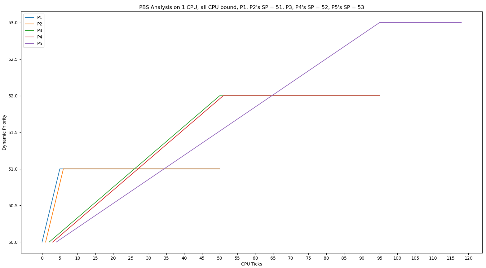

# OSN Mini Project 3 Report:

---

__NOTE:__ Run *make qemu SCHEDULER=...* to choose a scheduler other than the DEFAULT (Round Robin) scheduler! "..." can be either FCFS, MLFQ or PBS. Remove the "SCHEDULER" variable altogether to choose the default scheduler.

---
# xv-6 Revisited:
# Specification-1 (Modified Priority Based Scheduler - Pre-emptive):
## Assumptions:
1. For breaking ties between processes with the same dynamic priority, I assume that processes which have been scheduled lesser number of times will be given a higher priority (as in, will be chosen over processes that have been scheduled more number of times).
2. I also assume that for breaking ties, processes that have arrived earlier will have a higher priority.
3. According to Q17 of the doubts document, I assume that wTime is the total time that the process has been waiting for since it was created.

## Implementation Details:
1. Defined additional variables in the proc struct in proc.h. These are: sPriority (for static priority), rTime (for running time since the process was last scheduled), sTime (for sleeping time since the process was last scheduled), wTime (for waiting time since the process was created), RBI (to store the calculated Recent Behaviour Index), dPriority (for dynamic priority) and numScheds (to keep track of the number of times that the process was scheduled). Here, RBI and dPriority (DP) are as defined the specifications document.
2. The variables defined above have been initialised in proc.c in the allocproc() function. rTime, sTime, wTime and numScheds have been initialised to 0, while sPriority, RBI and dPriority have been initialised to 50, 25 and 75 respectively.
3. For each process, rTime, sTime and wTime are updated each tick (when which_dev == 2, i.e., timer interrupt) in usertrap() of trap.c. If the process is RUNNING, then increment rTime by 1. If the process is SLEEPING, then increment sTime by 1. If the process is RUNNABLE (i.e., waiting for its turn), then increment wTime by 1.
4. In scheduler() of proc.c, if PBS macro is defined at compile time, then, iterate through the process list and update its RBI and dPriority (DP) values. Now, choose which process to run, and store it in the currProcess (struct proc*) defined here. Use the tie-breaker as mentioned in the specifications document.
5. Once a suitable process is chosen, increment the numScheds (num of times it has been scheduled), and set its rTime and sTime to 0, and run the process (just like in the given RR code).
6. I have added the set_priority syscall to xv6 by:
   1. Adding a function definition (sys_set_priority()) to syscall.c, and add it to the table of syscalls in syscall.c after defining a macro in syscall.h (SYS_set_priority).
   2. Adding the actual function code to sysproc.c (uint64 sys_set_priority()).
   3. Adding the entry of syscall to usys.pl Perl script (entry("set_priority")).
   4. Adding the function prototype to user.h. (set_priority()).
7. This set_priority() call (sys_set_priority() in sysproc.c) takes pid and static priority value as inputs, processes the arguments, and calls the _int modifyPriority(int pid, int sPriority)_ function defined in proc.c. Here, modifyPriority() sets the given sPriority value for the process given by pid (finds it by iterating through the entire process list), and resets RBI to 25. After that, it calls yield() in order to find the process with the least dynamic priority to run at that instant.
8. I have modified schedulertest so that when PBS macro is defined at compile time, I/O processes run the set_priority function and set their own static priority to 25.
9. I have also modified schedulertest_cpu (only CPU-bound processes), so that 2 processes have static priority 51, 2 have static priority 52 and 1 has static priority 53.

## Analysis:
Since PBS is now pre-emptive, and since wTime is the number of ticks that the process has been waiting for since the process was created, while rTime and sTime are the number of ticks the process has been running/sleeping for since the process was last scheduled, (according to Q17, Q24 and Q27), this would imply that rTime is always either 0 or 1 (since even if the same process gets scheduled multiple times, its rTime will be reset). However, as wTime never gets reset for a process, it would eventually become > 3.

Since given, RBI = max(int((3\*rTime - sTime - wTime)\*50)/(rTime + wTime + sTime + 1)), 0), it would imply that 3\*rTime is atmost 3, atleast 0. But because wTime becomes > 3 eventually (since all processes cannot run simultaneously unless there's multiple CPUs available, every process must wait for some ticks), it would mean that 3\*rTime - wtime alone is < 0. Thus, RBI always gets set to 0, as 0 is the maximum of the two values. So, RBI is 0 most of the time.

Since dynamic priority, DP = min(SP+RBI, 100), as RBI is 0, it would mean that DP = SP most of the time. Thus, due to the pre-emptive nature of PBS, and the definitions of rTime, wTime and sTime, it would effectively mean that the dynamic priority is the same as the static priority most of the time. Thus, RBI is ineffective, so are the rTime, wTime and sTime variables. It is as good as setting DP = SP most of the time.

The implication of DP = SP is that, if all processes have the same static priority initially, then PBS would essentially be the same as round robin (RR), since ties are broken by the number of times each process is scheduled (and according to my assumption 1, the processes which have been scheduled lesser number of times will be given a higher priority). So, each process would be scheduled once, and after all processes are scheduled once and run for 1 tick each, they get scheduled again and run for 1 more tick and so on. This is like round robin with a time slice of 1.

If, however, all processes do not have the same static priority, then you can think of each priority value as a sort of priority queue, where in lower static priority values would run first in RR, followed by the next higher static priority and so on. It is like MLFQ with RR in each priority queue, but without promotions/demotions between priority queues (unless you manually run set_priority function).

In order to observe my findings that DP = SP most of the time, use:
```make qemu SCHEDULER=PBS PBSTEST=YES```
and run schedulertest. The first value is the current ticks, second value is the selected process pid, third value is that process's static priority and fourth value is that process's dynamic priority


__The following graph shows the DP v/s tick number for CPU-bound processes and I/O-bound processes on 1 CPU, where the static priority of each CPU-bound process is 50 and the static priority of each I/O-bound process is 25:__


__Observation:__ In schedulertest, as soon as each process is forked, its static priority is set to 50 by default. There is a tiny delay between the time the child fork is created and the set_priority function is run, so, initially, all processes have their static priority set to 50. Immediately after, for the 5 I/O processes (P1 to P5), their static priority drops to 25, because of set_priority on them. As can be observed, DP = SP almost always. As can be clearly observed, each tick, all 5 of the I/O processes get scheduled for an instant (because sleep() instanteously becomes runnable each tick and goes back to sleep, this is how it is implemented in xv6), and 1 of the 5 CPU processes gets scheduled. Infact, the 5 CPU processes run in round robin and the 5 I/O processes do aswell. The raw data for this can be observed in the "initial-xv6/refinedData.txt".

---

__The following graph shows the DP v/s tick number for CPU-bound processes on 1 CPU, where the static priority of P1 and P2 is 51, for P3 and P4 it is 52 and for P5 it is 53.__



__Observation:__ In schedulertest_cpu, as soon as each process is forked, its static priority is set to 50 by default. For P1 and P2, set_priority (with a tiny delay) sets the static priority to 51; for P3 and P4, after P1 and P2 are done running and they now gain control, set_priority sets the static priority to 52 and after P3 and P4 are done running, for P5, set_priority sets the static priority to 53. As can be observed, DP = SP almost always. Furthermore, it is like MLFQ with RR in each priority queue, but without promotions/demotions between priority queues, as can be clearly seen. The raw data for this can be observed in the "initial-xv6/refinedData2.txt".

---
---

# Concurrency:
# Specification-1 (Cafe Sim):
## Assumptions:
1. Input will always be redirected from a file, and won't be entered one line after another (since my simulation depends on a clock to get time reliably).
2. Customer index i details are given before customer index i+1's details in the input.
3. Customer index i arrives before or at the same time as customer index i+1 in the input.
4. If a customer arrives at time t, and they have tolerance time tol => they collect their order only if it gets done on or before t + tol.

## Implementation Details:
1. I have global arrays for drinks (array of structs with name and time to prep that drink), customers (array of structs with the pthread (customerThread), semaphore to make the customer wait on it (wait, initialised to 0), drinkID for their order (drinkID), their index (customerIdx), their arrival time (arrivalTime), their tolerance time (toleranceTime), the time at which their order was picked up by a barista to start preparing (orderPickedUpAt), and a boolean to check whether or not their order was done processing (doneProcessing)), as well as a boolean array to check whether each barista is free (isBaristaFree).
2. I also have global variables for B (number of baristas), K (number of drinks) and N (number of customers), as well as the number of drinks wasted (numDrinksWasted), number of customers processed (numCustomersProcessed) and the current barista index (currBaristaNum) to assign indices to each barista thread when they first start up. I also have a variable to keep track of the time in seconds since epoch to mark when the simulation has started (simStartTime), and have a semaphore to see the number of customers available, which each barista thread waits on (customerAvailable, initialised to 0), and a binary semaphore for mutex lock (mutex, initialised to 0), and a variable to keep track of the average customer wait time (avgCustomerWaitTime).
3. All the variables mentioned in 1 and 2 above are accessed only after a thread acquires the mutex lock, since they are all shared variables and any race condition could break the simulation.
4. All the variables and semaphores are initialised in the main() function. Barista threads are created before any input of customers is taken. They go into the makeDrink() function and they wait on the customerAvailable semaphore.
5. While taking input, the input waits (sleeps on a temporary inputSem semaphore which is initialised to 0, and is handled by a sem_timedwait) and doesn't take input UNTIL it is turn for that particular customer to enter the Cafe. When it is their turn, their input is taken and populated into the customers array, and a customer thread is created, which enters the waitForDrink() function. The customerAvailable semaphore is posted to aswell, to wake a barista up.
6. The customer thread then waits on its own "wait" semaphore using sem_timedwait, and is woken up when either a barista posts this thread (to indicate that their order is done preparing), or when their tolerance time runs out.
7. Now, when a barista wakes up, they first see if there's any other barista with an index lower than theirs that is currently free (since semaphores are non-deterministic in terms of which thread they wake up). If there is such a barista, the current barista thread posts again to the customerAvailable thread to hopefully wake that lower indexed barista thread up (each barista thread does this until that thread inevitably wakes up. This works depending on the scheduler implementation of semaphores, which is designed to prevent starvation).
8. Once the correct barista wakes up, they iterate through the array of customers and pick up the order of a customer whose order hasn't been picked up yet, provided that it has been atleast 1 second since they've placed their orders, and marks itself as not free anymore. Then, the barista waits until their order is finished (it just sleeps for a number of seconds equal to that, that the drink takes to be prepared), and then marks the customer's order as doneProcessing, and posts the customer's "wait" semaphore, and sleeps for 1 additional second before it takes a new order. It then marks itself as free.
9. Once the customer thread wakes up, it checks whether or not their order is done being prepared. If yes, then it takes its order and increments the numCustomersProcessed count, and exits. Else, if their order was picked up by a barista, but not done processing, it increments the numDrinksWasted count. In either case, if it doesn't receive its order, it prints a message the next second and marks that it is done processing, increments the numCustomersProcessed count and exits. Average customer wait time (avgCustomerWaitTime) is processed here accordingly (check my answer to the follow up question Q1).
10. A barista thread exits once the numCustomersProcessed count hits the total number of customers N.
11. After all customer threads have exit, and all barista threads have exit (a barista thread is woken up from its sleep on the customerAvailable semaphore by a post, and then checks whether numCustomersProcessed == N or not), they are joined to the parent using pthread_join and then, the statistics are printed, on the number of coffees wasted and the average time taken for a barista to prepare order, and average time taken in the infinite barista case for a customer's order to be prepared. Once this is done, the simulation exits.


## Answers to follow up questions:
Q1. __Waiting Time:__ _Calculate the average time a customer spends waiting for their coffee. Determine if this is more than (and how much) if the cafe had infinite baristas. Coffee prep time is not part of waiting time._ <br />
A1. For a customer who receives their order, waiting time is defined as the between arrival of a customer, and the time at which their order is picked up by a barista.
For a customer who doesn't receive their order, waiting time is just their tolerance time.

This definition is inferred from the definition wait time = total time spent in cafe - prep time of coffee, but prep time of coffee = 0 for a customer who doesn't get their order (as mentioned in query 40 of the Cafe Sim doubts document.)

Under this definition of waiting time, if there are infinite baristas (same as there being an equal number of baristas as there are customers), then, if a customer receives their order (i.e., their tolerance time is atleast 1 second more (as a barista can pick their order up only from the next second) than the time required to prepare their order), then their waiting time is 1 second. Else, they never get their order, and so, their waiting time is just their tolerance time.

I have created a function (calculateInfBaristaAvgWaitTime()) to handle this. The main() function, at the end of the simulation, prints info of the current wait time and the wait time that would've been possible with infinite baristas, and the difference between the two. Note that the infinite barista case will ALWAYS have a lower wait time, because a customer needn't ever wait more than a second for a barista to take their order.


Q2. __Coffee Wastage:__ _Determine how many coffees are wasted. Print the number of coffees wasted after the simulation ends._ <br />
A2. Whenever a customer places an order for a coffee, but if their order takes too long to be taken up and prepared by a barista, they leave. If a barista has already picked up their order by this point, then a coffee is wasted.

My simulation attempts to minimise coffee wastage, by first completing orders pending that second, and then checking customers' patience.

I count the number of such coffees wasted (but a barista never stops midway while preparing an order), and print them at the end of the simulation. I have a global variable "numDrinksWasted" for this purpose (always used with a mutex lock to prevent race conditions). The value of this variable is printed at the end of the simulation.

---

# Specification-2 (Ice Cream Parlour Sim):
## Assumptions:
1. Input will always be redirected from a file, and won't be entered one line after another (since my simulation depends on a clock to get time reliably).
2. Customer index i details are given before customer index i+1's details in the input.
3. Customer index i arrives before or at the same time as customer index i+1 in the input.
4. All flavours have an unlimited quantity.
5. Each topping can be placed instantaneously.
6. A machine will prepare any order that ends exactly at or before the time when the machine is supposed to end its shift, and only then it takes the day off.
7. Two pronged approach to ingredient shortages -> Once when the customer first places their order (no ingredients wasted), and again when the order is actually being prepared (ingredients may be wasted for previous orders of the same customer).
8. According to the response to Q15, a machine can take up an order in the same second that it is done processing the previous order.
9. When the parlor runs out of limited quantity ingredients, all the machines will be shut down and no new customers will be allowed, but the customers whose ingredients are currently being prepared are allowed to pick them up and leave once they are done being prepared. Once all the existing customers leave (which should happen immediately after all the machines are done preparing their pending orders), the parlor closes.
10. If a machine has just started working, then if there are orders that began before the timestamp that it started working in (t-1 or earlier), then the machine immediately picks up the order.
11. Once the machine is done processing an order, it sleeps for a second and then starts taking a new order (it won't pick up a new order in the same timestamp).

## Implementation Details:
1. I have global arrays for flavours or toppings (FTs) (array of structs (flavourOrTopping) with name, quantity and time to prep that ingredient (prepTime)), customers (array of structs (customer) with the pthread (customerThread), their index (customerIdx), their arrival time (arrivalTime), their number of orders (numOrders), an array of structs(orderInfo) of their orders (each struct has a semaphore for the customer to wait on (wait), total time to prep that order (totalTimeToPrep), array of ingredient counts required to prepare that order (FTcounts), and a boolean to check whether or not their order was picked up by a machine (orderPickedUp)), machines (array of structs (machineInfo) with a pthread for each machine (machineThread), index of machine (idx), start time of machine (startTime), end time of machine (endTime), a boolean to check whether the machine is currently processing an order (currentlyBusy) and a boolean to check whether the machine has stopped working (hasLeft)).
2. I also have global variables for F (number of flavours), T (number of toppings), K (max number of customers in parlour at any given time) and N (number of machines), as well as the number of customers turned away due to a full parlour (numCustomersTurnedAwayDueToFullParlour), number of customers turned away due to ingredient shortages (numCustomersTurnedAwayDueToIngredientShortages), number of customers turned away due to an unavailability of machines (numCustomersTurnedAwayDueToUnavailabilityOfMachines) and number of customers immediately rejected due to ingredient shortages (numCustomersImmediatelyRejectedDueToIngredientShortages). I also have a variable to keep track of the time in seconds since epoch to mark when the simulation has started (simStartTime), and have a semaphore to see the number of orders available, which each machine thread waits on (ordersAvailable, initialised to 0), and a binary semaphore for mutex lock (mutex, initialised to 0). I also have a boolean variable to see if there are any limited-quantity ingredients left (ingredientsLeft).
3. All the variables mentioned in 1 and 2 above are accessed only after a thread acquires the mutex lock, since they are all shared variables and any race condition could break the simulation.
4. All the variables and semaphores are initialised in the main() function. Machine threads are created before any input of customers is taken. They go into the startMachine() function and they wait on the ordersAvailable semaphore.
5. While taking input, the main() function first checks if there are limited-quantity ingredients still available or not (with the boolean ingredientsLeft), and if not, jumps to the end of parlour. Else, if there are such ingredients available, the input waits (sleeps on a temporary inputSem semaphore which is initialised to 0, and is handled by a sem_timedwait) and doesn't take input UNTIL it is turn for that particular customer to enter the parlour. When it is their turn, their input is taken and populated into the customers array, and a customer thread is created, which enters the waitForOrders() function. A thread is created (tempOrdersPost) which posts to the ordersAvailable semaphore as many times as there are orders made by this customer, after 1 second (since machines can start working on an order only atleast 1 second after they've been placed).
6. The customer thread then waits on its own "wait" semaphores for each order using sem_wait.
7. Now, when a machine starts up (they first wait on machineWait semaphore until it is their turn to start, using sem_timedwait), they first check if there's any ingredient shortages for the limited-quantity ingredients. If yes, they shut down all the other machine threads (except those that are currently busy) and then exit themselves. If there are no such ingredient shortages, they immediately check if it is their turn to exit (because they've run out of their shift time). If not, they see there's any other machine with an index lower than theirs that is currently free (since semaphores are non-deterministic in terms of which thread they wake up) and can take an order. If there is such a machine, the current machine thread posts again to the ordersAvailable thread to hopefully wake that lower indexed machine thread up (each machine thread does this until that thread inevitably wakes up. This works depending on the scheduler implementation of semaphores, which is designed to prevent starvation).
8. Once the correct machine wakes up, they iterate through the array of customers and pick up the order of a customer which hasn't been picked up yet, provided that it has been atleast 1 second since they've placed their orders, and it can be prepared before the machine stops working, has enough ingredients to be prepared (and also decrements the global ingredients array quantities (FTs)), and marks itself as not free anymore. If there arises an ingredient shortage, then the machine immediately turns away the customer, and goes back to sleep. Else, the machine waits until their order is finished (it just sem_timedwait on machineWait semaphore for a number of seconds equal to that, that the order takes to be prepared), and then notifies the customer thread that the order is done (by sem_post on that order's "wait" semaphore).
9. Once the customer thread wakes up (after all of its orders have been posted), it checks if all of its orders have been picked up by a machine or not (if not, then it knows that it was posted BECAUSE all machines have left. This is done in the main() function.). If yes, then the customer picks up its order and exits. If not, it exits, but due to an unavailability of machines.
10. A machine thread exits once it is time for the machine to leave (shift end time, as specified in endTime of the machine struct), or if there is a limited-quantity ingredient shortage.
11. After all customer threads have exit, and all machine threads have exit, they are joined to the parent using pthread_join and then, the statistics are printed, on the number of customers immediately immediately rejected due to ingredient shortages, the number of customers turned away due to a lack of free space in the parlour, the number of customers turned away later by a machine due to ingredient shortages and the number of customers not serviced due to an unavailability of machines.

## Answers to follow up questions:
Q1. __Minimizing Incomplete Orders:__ _Describe your approach to redesign the simulation to minimize incomplete orders, given that incomplete orders can impact the parlor’s reputation. Note that the parlor’s reputation is unaffected if orders are instantly rejected due to topping shortages._ <br />
A1. Incomplete orders are those where a customer's orders were initially accepted when they placed the order because there were sufficient ingredients, but later on when a machine actually begins to prepare one of their orders, it realises that due to some other customers' orders that arrived in between, there is now an ingredient shortage. So, all the previous orders made for this customer are thrown away, and the customer leaves with an unfulfilled order (ingredients are wasted).

Now, in order to minimize these incomplete orders, given that the parlor's reputation is unaffected if orders are instantly rejected due to topping shortages (right at the start, when the customer first places all their orders), I would reserve toppings for a customer the moment that they arrive, so that other customers can be instantly rejected due to topping shortages, and so, the parlor's reputation won't be affected. Essentially, this would mean that I would prioritise customers who arrive early, if I have a limited number of toppings (like I do, currently). Reserving of toppings for customers would in this case, be a good idea to minimise damage to the parlor's reputation. (Note that currently, reserving of toppings is not allowed).

However, if I still am not allowed to reserve toppings, then I would make it so that in each second, I would first make all available machines take up orders (if there are sufficiently many orders), and update the remaining ingredient counts. Only after this, I would accept/reject the orders placed by a customer that arrives at that second. This would ensure that I have all the necessary remaining ingredient count to decide whether or not to accept/reject a customer's order immediately. That way, there is a higher likelihood of a customer's order being instantly rejected due to topping shortages, thereby reducing the damage to the parlor's reputation.


Q2. __Ingredient Replenishment:__ _Assuming ingredients can be replenished by contacting the nearest supplier, outline how you would adjust the parlour order acceptance/rejection process based on ingredient availability._ <br />
A2. If ingredients can be replenished by contacting the nearest supplier, there's a couple of factors that come into play.

1. I need to know the time taken for the nearest supplier to deliver the ingredients that I have ordered.
2. I need to know how many of each ingredient that the nearest supplier has in stock.
3. I need to know the "price" of each ingredient, or if there is some sort of penalty for buying more ingredients than I require.
4. I need to know if the supplier is able to replenish their stocks after a fixed amount of time, and the time at which this happens.

Assuming that I know all of the aforementioned information, <br />
if there is no penalty for buying more ingredients than I require, then I can simply buy out all the available stock that the supplier has right before I open my store (I would place an order for them), and then start taking orders from customers. I would accept/reject their orders, based on the count of ingredients available at that instant, but would update my ingredient count as soon as my order of more ingredients gets delivered. As soon as the supplier replenishes their stocks (if they are able to), I would buy out their entire stock again. I would keep doing this until all my machines are done servicing for the day.

However, if there is a penalty for buying more ingredients than I require, then while taking a customer's order, I would first check whether or not I have enough ingredients to fulfill their order. If not, I check if I can order just the required amount of ingredients from the store to fulfill their order. If yes, I accept their order and place an order at the store to send me those ingredients. If no, then I reject their order since I cannot possibly fulfill their order, due to ingredient shortages.

In both cases, I wouldn't immediately make a machine send a customer away if there is an ingredient shortage. Rather, I would again check with the store and see if I can place a new order for more ingredients to fulfill their order, and I would also see if I have any orders waiting to be delivered. Once a shipment has been delivered, if there are machines which are still on their shift, then I would make them try and prepare the customer's order.

Q3. __Unserviced Orders:__ _Suggest ways by which we can avoid/minimise the number of unserviced orders or customers having to wait until the parlor closes._ <br />
A3. A customer has to wait until the parlor closes, if there is no machine available to take up their order. This will lead to their order being unserviced.

In order to avoid/minimise the number of such unserviced orders you could:
1. Employ more machines which work for longer periods during different times of day.
2. Upgrade the machines so that they can process multiple orders parallel-ly.

---

