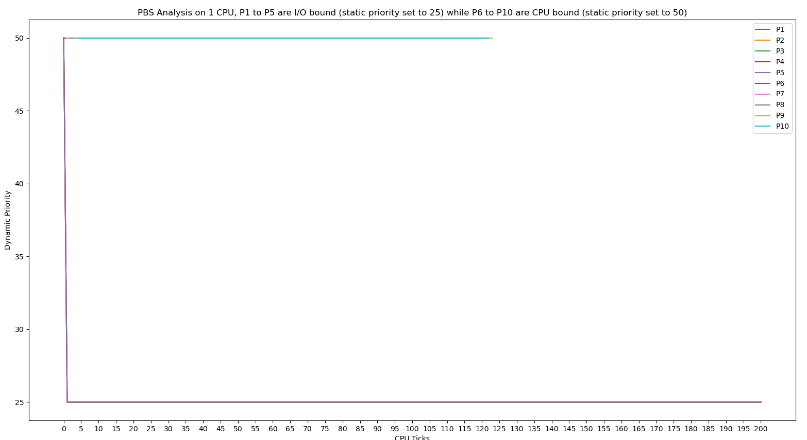
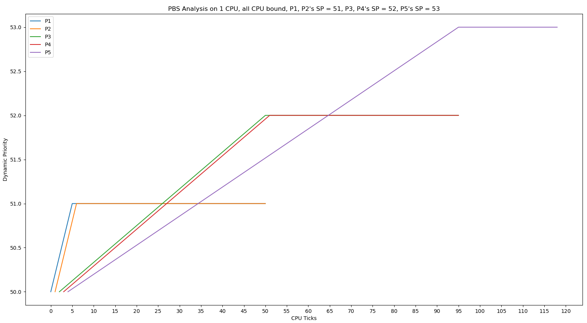

# Advanced-XV6

---

This repository contains the XV6 portion of Mini Projects 2 and 3 of the **Operating Systems and Networks course**,
taken in the Monsoon'23 semester at IIIT Hyderabad.

---

# Contents

1. **Schedulers**
    1. [First Come-First Serve (FCFS)](#first-come-first-serve-fcfs)
    2. [Multi-Level Feedback Queues (MLFQ)](#multi-level-feedback-queues-mlfq)
    3. [Modified Priority Based Scheduler (PBS)](#modified-priority-based-scheduler-pbs)
2. [**Copy-on-Write (CoW) fork**](#copy-on-write-cow-fork)
3. **System calls**
    1. [getreadcount](#getreadcount)
    2. [sigalarm and sigreturn](#sigalarm-and-sigreturn)
    3. [set_priority](#set_priority)

---

# Pre-requisites

1. [RISC-V "newlib" toolchain](https://github.com/riscv/riscv-gnu-toolchain)
2. qemu compiled for `riscv64-softmmu`
3. `make`
4. `expect` package (to run `/initial-xv6/test-getreadcount.sh`)

---

# Schedulers

**Note:** Not picking a scheduler during compilation will cause XV6 to default to the Round Robin scheduler.

## First Come-First Serve (FCFS)

The FCFS scheduler is a non-preemptive scheduling algorithm that selects the process that arrived first in the ready
queue to execute first.

### Implementation overview

1. Used the `ctime` variable in the `proc` struct to keep track of the arrival time of the process.
2. Implemented the FCFS scheduling algorithm in the `scheduler` function in `proc.c` using the `#ifdef FCFS`
   pre-processor
   directive (defined a way to take a macro as input from the user during compilation, in the
   `initial_xv6/src/Makefile`).
3. Ensured that the scheduler is non-preemptive by disabling the timer interrupt in `trap.c` when the FCFS macro is
   defined.

### Instructions to run

Navigate to `initial-xv6/src` and compile using ```make qemu SCHEDULER=FCFS```.

## Multi-Level Feedback Queues (MLFQ)

The MLFQ scheduler is a preemptive scheduling algorithm that uses multiple queues with different priority levels to
schedule processes.

### Implementation overview

1. Added variables to the `proc` struct to keep track of the current priority queue, elapsed ticks, and wait ticks.
2. Implemented the MLFQ scheduling algorithm in the `scheduler` function in `proc.c` using the `#elif defined(MLFQ)`
   pre-processor directive.
3. Ensured that the scheduler is preemptive by handling timer interrupts in `trap.c`.

### Instructions to run

Navigate to `initial-xv6/src` and compile using ```make qemu SCHEDULER=MLFQ```.

### Analysis
#### Timeline plot for CPU-bound processes in MLFQ on 1 CPU, with 5 processes:


## Modified Priority Based Scheduler (PBS)

The PBS scheduler is a preemptive scheduling algorithm that uses dynamic priority values to schedule processes.

### Implementation overview

1. Added variables to the `proc` struct to keep track of static priority, running time, sleeping time, waiting time, and
   dynamic priority.
2. Implemented the PBS scheduling algorithm in the `scheduler` function in `proc.c` using the `#elif defined(PBS)`
   pre-processor directive.
3. Added the `set_priority` syscall to allow processes to change their static priority.

### Instructions to run

Navigate to `initial-xv6/src` and compile using ```make qemu SCHEDULER=PBS```.

### Analysis

#### DP v/s tick number for CPU-bound processes and I/O-bound processes on 1 CPU

Here, the static priority of each CPU-bound process is 50 and the static priority of each I/O-bound process is 25.



__Observation:__ In schedulertest, as soon as each process is forked, its static priority is set to 50 by default. There
is a tiny delay between the time the child fork is created and the set_priority function is run, so, initially, all
processes have their static priority set to 50. Immediately after, for the 5 I/O processes (P1 to P5), their static
priority drops to 25, because of set_priority on them. As can be observed, DP = SP almost always. As can be clearly
observed, each tick, all 5 of the I/O processes get scheduled for an instant (because sleep() instanteously becomes
runnable each tick and goes back to sleep, this is how it is implemented in xv6), and 1 of the 5 CPU processes gets
scheduled. Infact, the 5 CPU processes run in round robin and the 5 I/O processes do aswell. The raw data for this can
be observed in the "initial-xv6/refinedData.txt".

#### DP v/s tick number for CPU-bound processes on 1 CPU

Here, the static priority of P1 and P2 is 51, for P3 and P4 it is 52 and for P5 it is 53.



__Observation:__ In schedulertest_cpu, as soon as each process is forked, its static priority is set to 50 by default.
For P1 and P2, set_priority (with a tiny delay) sets the static priority to 51; for P3 and P4, after P1 and P2 are done
running and they now gain control, set_priority sets the static priority to 52 and after P3 and P4 are done running, for
P5, set_priority sets the static priority to 53. As can be observed, DP = SP almost always. Furthermore, it is like MLFQ
with RR in each priority queue, but without promotions/demotions between priority queues, as can be clearly seen. The
raw data for this can be observed in the "initial-xv6/refinedData2.txt".


---

# Copy on Write (CoW) fork

The Copy-on-Write (CoW) fork optimizes the `fork` system call by delaying the copying of the process's memory pages
until they are actually written to.

### Implementation overview

1. Modified the `fork` function to set up the page tables such that the parent and child processes share the same
   physical pages initially.
2. Marking these shared pages as read-only (using a bitmask to utilize a bit as a flag).
3. When a write to a shared page occurs, handling the page fault by duplicating the page and updating the page table
   entry to point to the new page.
4. Updating the reference counts and managing the memory correctly to ensure that pages are duplicated only when
   necessary, and that pages with no references are freed up to reclaim memory.

### Instructions to run

This fork was implemented to replace the default `fork()` system call in XV6. Hence, you do not need to run this
separately; it will automatically run whenever the `fork()` system call is called. It is the new default `fork()`
procedure.

---

# System calls

## getreadcount

The `getreadcount` system call returns the number of times the `read` system call has been invoked by the current
process.

### Implementation overview

1. Added the function definition to `syscall.c` and added it to the syscall table after defining a macro in `syscall.h`.
2. Implemented the actual function code in `sysfile.c`.
3. Added an entry of the syscall to the `usys.pl` Perl script.
4. Added the function prototype to `user.h`.

### Instructions to run

After compiling and running XV6 (with any scheduler of your choice), simply run `getreadcount` to get the current read
count. To modify its behaviour, you can modify `initial-xv6/src/user/getreadcount.c` and recompile.

To test `getreadcount`, just run `test-getreadcount.sh` in `initial-xv6`.

## sigalarm and sigreturn

The `sigalarm` system call allows a process to specify a function to be called after a certain number of timer ticks.
The `sigreturn` system call returns control from the signal handler back to the main program.

### Implementation overview

1. Modified the `proc` struct in `proc.h` and `proc.c` to store fields such as the number of ticks (`numTicks`), the
   pointer to the function (`alarmHandler`), etc.
2. Implemented the `usertrap` function in `trap.c` to handle the timer interrupts.
3. Implemented the `sys_sigalarm` and `sys_sigreturn` functions in `sysproc.c`.
4. Added entries of the syscalls to the `usys.pl` Perl script.
5. Added function prototypes to `user.h`.

### Instructions to run

After compiling and running XV6 (with any scheduler of your choice), simply run `alarmtest` to test sigalarm and
sigreturn system calls. To modify its behaviour, you can modify `initial-xv6/src/user/alarmtest.c` and recompile.

## set_priority

The `set_priority` system call allows a process to change the static priority of another process.

### Implementation overview

1. Defined the `set_priority` syscall in `syscall.c` and added it to the syscall table in `syscall.c` after defining a
   macro in `syscall.h`.
2. Implemented the actual function code in `sysproc.c` (`uint64 sys_set_priority()`).
3. Added the entry of the syscall to the `usys.pl` Perl script (`entry("set_priority")`).
4. Added the function prototype to `user.h` (`int set_priority(int pid, int priority)`).
5. Modified `schedulertest` to use the `set_priority` system call.

### Instructions to run

After compiling and running XV6 (with PBS scheduler), you can run the `schedulertest` program to test the
`set_priority` system call.

To change the priority of a process, you can use the `set_priority` function within the `schedulertest` program or
any other user program.

---

# LICENSE

See [LICENSE](LICENSE) for details.